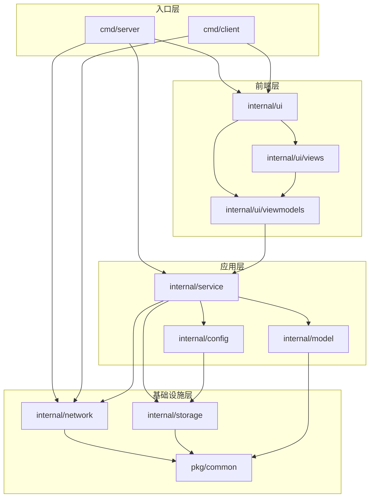

# SyncTools 代码库文档

## cmd/
### client/main.go
- **文件作用**：
  - 实现客户端的主程序入口
  - 初始化GUI界面和各种组件
  - 管理客户端配置和同步状态
  - 处理与服务器的通信
- **主要方法**：
  - NewSyncClient: 创建新的同步客户端
  - connect: 连接到同步服务器
  - syncWithServer: 执行文件同步操作
  - handlePackSync: 处理打包同步模式
  - handleMirrorSync: 处理镜像同步模式

### server/main.go
- **文件作用**：
  - 实现服务器的主程序入口
  - 初始化服务器配置和组件
  - 启动网络服务和GUI界面
  - 管理服务器状态和配置
- **主要方法**：
  - main: 程序入口,初始化各个组件并启动服务器
  - initConfig: 初始化服务器配置
  - setupLogger: 设置日志记录器
  - createSyncService: 创建同步服务
  - handlePanic: 处理全局异常

## internal/

### config/
#### manager.go
- **文件作用**：
  - 实现配置管理功能
  - 管理配置文件读写
  - 维护配置缓存
  - 提供配置验证
- **主要方法**：
  - NewManager: 创建配置管理器
  - LoadConfig: 加载配置文件
  - SaveConfig: 保存配置文件
  - ValidateConfig: 验证配置有效性
  - GetCurrentConfig: 获取当前配置

### network/
#### server.go
- **文件作用**：
  - 实现网络服务器功能
  - 处理客户端连接
  - 管理文件同步请求
  - 提供文件传输服务
- **主要方法**：
  - NewServer: 创建服务器实例
  - Start: 启动服务器
  - Stop: 停止服务器
  - HandleClient: 处理客户端连接
  - SendFile: 发送文件到客户端

### service/
#### sync_service.go
- **文件作用**：
  - 实现同步服务功能
  - 管理配置和状态
  - 处理同步操作
  - 协调网络和文件操作
- **主要方法**：
  - NewSyncService: 创建同步服务
  - Start: 启动同步服务
  - Stop: 停止同步服务
  - SyncFiles: 执行文件同步
  - HandleSyncRequest: 处理同步请求

### ui/
#### main_window.go
- **文件作用**：
  - 实现主窗口界面
  - 管理界面布局
  - 处理用户交互
  - 集成各个功能模块
- **主要方法**：
  - NewMainWindow: 创建主窗口
  - Run: 运行窗口程序
  - InitMenus: 初始化菜单
  - InitTabs: 初始化标签页
  - ShowError: 显示错误信息
  - ShowMessage: 显示消息提示

#### viewmodels/config_viewmodel.go
- **文件作用**：
  - 实现配置界面的视图模型
  - 管理配置数据绑定
  - 处理配置界面交互
  - 提供配置操作接口
- **主要方法**：
  - NewConfigViewModel: 创建配置视图模型
  - LoadConfig: 加载配置
  - SaveConfig: 保存配置
  - UpdateUI: 更新界面
  - AddSyncFolder: 添加同步文件夹
  - RemoveSyncFolder: 移除同步文件夹

#### viewmodels/interfaces.go
- **文件作用**：
  - 定义视图模型接口
  - 定义数据绑定接口
  - 定义事件处理接口
  - 提供通用接口约束
- **主要接口**：
  - ViewModel: 视图模型基础接口
  - DataBinder: 数据绑定接口
  - EventHandler: 事件处理接口
  - ListModel: 列表模型接口
  - ItemViewModel: 列表项视图模型接口

#### viewmodels/main_viewmodel.go
- **文件作用**：
  - 实现主窗口的视图模型
  - 管理全局状态
  - 协调各个子视图模型
  - 处理主窗口事件
- **主要方法**：
  - NewMainViewModel: 创建主窗口视图模型
  - InitializeViewModels: 初始化子视图模型
  - HandleCommand: 处理命令
  - UpdateStatus: 更新状态
  - ShowDialog: 显示对话框

#### views/config_tab.go
- **文件作用**：
  - 实现配置界面的UI布局和交互
  - 管理配置界面的各个控件
  - 处理用户界面事件
  - 与视图模型层交互
- **主要方法**：
  - NewConfigTab: 创建新的配置界面
  - Setup: 设置UI组件和布局
  - onConfigActivated: 处理配置选择事件
  - onNewConfig: 处理新建配置事件
  - onDeleteConfig: 处理删除配置事件
  - onSave: 处理保存配置事件

## pkg/common/
#### logger.go
- **文件作用**：
  - 实现日志记录功能
  - 定义日志接口和实现
  - 提供调试日志支持
  - 管理日志输出格式
- **主要方法**：
  - NewDefaultLogger: 创建默认日志记录器
  - NewCallbackLogger: 创建回调日志记录器
  - Log: 记录普通日志
  - Error: 记录错误日志
  - DebugLog: 记录调试日志
  - SetDebugMode: 设置调试模式

#### types.go
- **文件作用**：
  - 定义核心数据类型
  - 实现配置管理功能
  - 提供文件操作工具
  - 管理同步状态信息
- **主要方法**：
  - LoadConfig: 加载配置文件
  - SaveConfig: 保存配置文件
  - ValidateConfig: 验证配置有效性
  - CalculateFileHash: 计算文件哈希值
  - DecompressFiles: 解压文件

#### utils.go
- **文件作用**：
  - 提供通用工具函数
  - 实现文件操作功能
  - 提供加密和解密方法
  - 处理路径和目录操作
- **主要方法**：
  - CalculateFileHash: 计算文件哈希值
  - CompressFiles: 压缩文件
  - DecompressFiles: 解压文件
  - ValidatePath: 验证路径有效性
  - EnsureDir: 确保目录存在

## 文件依赖关系

### 层级说明

1. **前端层**
   - 负责用户界面展示和交互
   - 包含视图(Views)和视图模型(ViewModels)
   - 使用 walk 库实现 GUI 功能

2. **应用层**
   - 实现核心业务逻辑
   - 协调各个组件工作
   - 管理配置和同步服务

3. **基础设施层**
   - 提供底层功能支持
   - 实现网络通信
   - 处理数据存储
   - 提供通用工具

4. **入口层**
   - 提供程序入口点
   - 初始化各个组件
   - 启动服务和界面