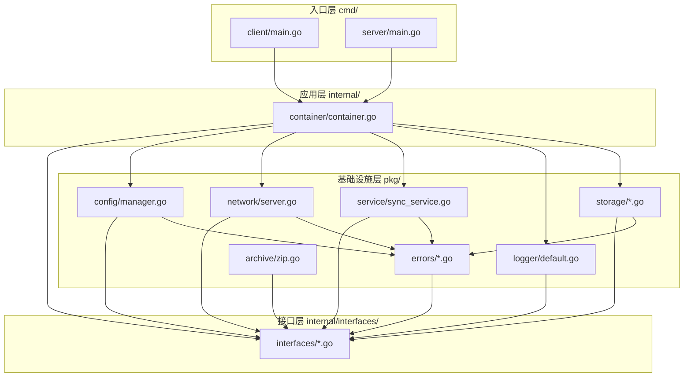

# SyncTools 代码库说明

## 文件说明

### cmd/ - 入口程序
#### client/main.go
- **文件作用**：
  - 实现客户端的主程序入口
  - 初始化客户端配置和组件
  - 启动GUI界面和同步服务
  - 管理客户端状态和配置
- **主要方法**：
  - main: 程序入口,初始化各个组件并启动GUI界面
  - init: 初始化基础配置和命令行参数
  - loadOrCreateConfig: 加载或创建默认配置文件

#### server/main.go
- **文件作用**：
  - 实现服务器的主程序入口
  - 初始化服务器配置和组件
  - 启动网络服务和GUI界面
  - 管理服务器状态和配置
- **主要方法**：
  - main: 程序入口,初始化各个组件并启动服务器
  - init: 初始化基础配置和命令行参数
  - loadOrCreateConfig: 加载或创建默认配置文件

### internal/ - 内部包
#### container/container.go
- **文件作用**：
  - 实现依赖注入容器
  - 管理所有服务实例的生命周期
  - 提供服务注册和获取功能
  - 负责服务的初始化和关闭
- **主要方法**：
  - New: 创建新的依赖注入容器
  - Register: 注册服务到容器
  - Get: 从容器获取服务
  - InitializeServices: 初始化所有服务
  - GetLogger/GetConfigManager/GetNetworkServer/GetSyncService/GetStorage: 获取特定服务
  - Shutdown: 关闭所有服务

### pkg/ - 可重用包
#### config/manager.go
- **文件作用**：
  - 实现配置管理器
  - 负责配置文件的加载、保存和验证
  - 管理配置的生命周期和变更通知
  - 提供配置的CRUD操作
- **主要方法**：
  - NewManager: 创建新的配置管理器
  - LoadConfig: 加载配置文件
  - SaveConfig: 保存配置到文件
  - ValidateConfig: 验证配置有效性
  - GetCurrentConfig: 获取当前配置
  - GetLastModified: 获取最后修改时间
  - ListConfigs: 获取所有配置列表
  - SetOnChanged: 设置配置变更回调

#### network/server.go
- **文件作用**：
  - 实现网络服务器
  - 管理客户端连接
  - 处理网络消息和数据传输
  - 提供服务器状态管理
- **主要方法**：
  - NewServer: 创建新的网络服务器
  - Start: 启动服务器
  - Stop: 停止服务器
  - HandleClient: 处理客户端连接
  - GetStatus: 获取服务器状态
  - IsRunning: 检查服务器是否运行中
  - acceptLoop: 接受新的客户端连接
  - addClient/removeClient: 管理客户端连接

#### service/sync_service.go
- **文件作用**：
  - 实现文件同步服务
  - 管理文件同步状态和进度
  - 处理同步请求和响应
  - 提供同步操作的核心功能
- **主要方法**：
  - NewSyncService: 创建新的同步服务
  - Start: 启动同步服务
  - Stop: 停止同步服务
  - SyncFiles: 同步指定路径的文件
  - HandleSyncRequest: 处理同步请求
  - GetSyncStatus: 获取同步状态
  - setStatus: 设置同步状态

#### errors/network.go
- **文件作用**：
  - 定义网络相关错误类型
  - 实现网络错误处理
  - 提供网络错误创建和判断功能
  - 实现net.Error接口
- **主要内容**：
  - NetworkError: 网络错误类型,实现error和net.Error接口
  - NewNetworkError: 创建新的网络错误
  - Error: 获取错误信息
  - IsTimeout: 判断是否为超时错误
  - IsTemporary: 判断是否为临时错误
- **预定义错误**：
  - ErrNetworkConnect: 网络连接失败
  - ErrNetworkTimeout: 网络超时
  - ErrNetworkClosed: 网络连接已关闭
  - ErrNetworkInvalidData: 无效的网络数据
  - ErrNetworkServerStart: 服务器启动失败

## 依赖关系图

## 层级说明

1. **入口层** (`cmd/`)
   - 提供程序入口点
   - 初始化和启动应用
   - 通过容器组装组件
   - 处理命令行参数

2. **应用层** (`internal/container/`)
   - 实现依赖注入容器
   - 管理组件生命周期
   - 协调各个组件
   - 提供服务访问接口

3. **接口层** (`internal/interfaces/`)
   - 定义所有核心接口
   - 定义共享数据类型
   - 实现依赖倒置
   - 确保模块解耦

4. **基础设施层** (`pkg/`)
   - 实现具体功能
   - 实现接口定义
   - 处理技术细节
   - 提供错误处理