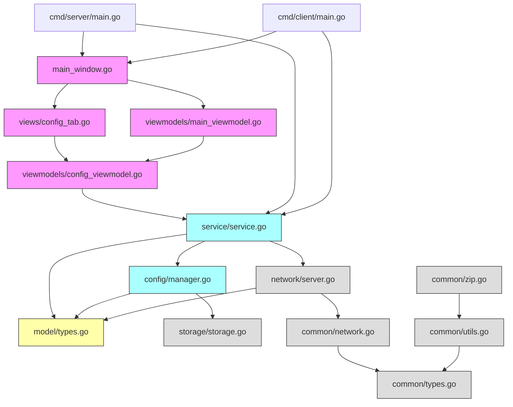
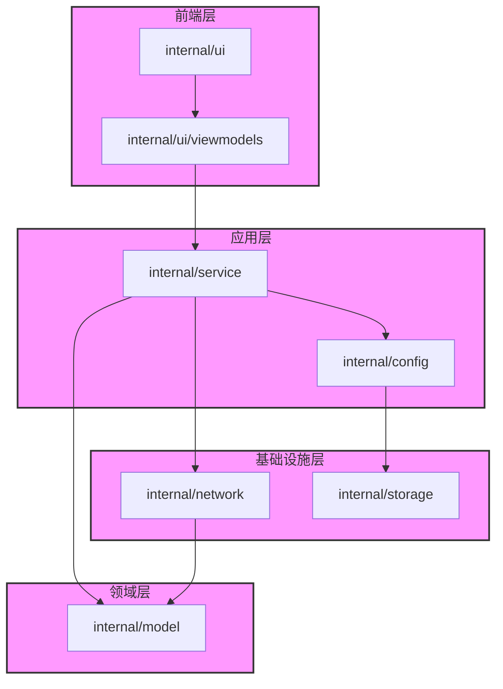

# SyncTools 代码库文档

## cmd/
### client/main.go
客户端入口文件，负责启动客户端应用程序。

### server/main.go
服务器入口文件，负责启动服务器应用程序。

## internal/

### config/
#### manager.go
- **文件作用**：
  - 管理配置文件的读取和保存
  - 维护当前活动配置
  - 处理配置变更通知
  - 提供配置验证功能
- **主要方法**：
  - NewManager: 创建新的配置管理器
  - LoadConfig: 加载指定的配置文件
  - SaveConfig: 保存配置到文件
  - GetCurrentConfig: 获取当前活动配置
  - ValidateConfig: 验证配置有效性

### model/
#### types.go
- **文件作用**：
  - 定义核心数据结构和接口
  - 实现配置模型
  - 提供状态管理功能
  - 定义同步模式和操作类型
- **主要类型**：
  - Config: 配置信息结构
  - SyncFolder: 同步文件夹配置
  - ClientState: 客户端状态信息
  - PackState: 压缩包状态信息
  - Logger: 日志记录接口

#### logger.go
- **文件作用**：
  - 定义日志接口
  - 提供日志记录功能
  - 支持不同级别的日志

### network/
#### server.go
- **文件作用**：
  - 实现服务器端网络通信
  - 管理客户端连接
  - 处理同步请求
  - 实现文件传输
- **主要类型**：
  - Server: 网络服务器
  - Client: 客户端连接
  - ClientMessage: 客户端消息
  - FileOperation: 文件操作接口
  - TransferResult: 传输结果
- **主要方法**：
  - NewServer: 创建新的服务器实例
  - Start: 启动服务器
  - Stop: 停止服务器
  - handleMessage: 处理客户端消息
  - handleSyncRequest: 处理同步请求
  - handleFileTransfer: 处理文件传输
  - handlePackTransfer: 处理压缩包传输
  - sendResponse: 发送响应消息

### service/
#### service.go
- **文件作用**：
  - 实现业务逻辑服务
  - 协调各个组件的工作
  - 处理同步操作
  - 管理配置服务

### storage/
#### storage.go
- **文件作用**：
  - 提供统一的存储接口
  - 实现基于文件系统的存储
  - 支持多种数据类型的存储和加载
  - 管理配置文件的持久化
- **主要类型**：
  - Storage: 存储接口定义
  - FileStorage: 基于文件系统的存储实现
- **主要方法**：
  - NewFileStorage: 创建新的文件存储实例
  - Save: 保存数据到存储
  - Load: 从存储加载数据
  - Delete: 删除存储的数据
  - List: 列出所有存储的数据项

### ui/
#### main_window.go
- **文件作用**：
  - 实现主窗口界面
  - 管理界面布局
  - 处理窗口事件

#### viewmodels/config_viewmodel.go
- **文件作用**：
  - 实现配置界面的视图模型
  - 管理配置数据绑定
  - 处理配置界面交互
  - 提供配置操作接口
- **主要类型**：
  - ConfigViewModel: 配置视图模型
  - ConfigListModel: 配置列表模型
  - SyncFolderModel: 同步文件夹模型
- **主要方法**：
  - NewConfigViewModel: 创建配置视图模型
  - LoadConfig: 加载配置
  - SaveConfig: 保存配置
  - UpdateUI: 更新界面
  - AddSyncFolder: 添加同步文件夹
  - RemoveSyncFolder: 移除同步文件夹

#### viewmodels/interfaces.go
- **文件作用**：
  - 定义视图模型接口
  - 定义UI组件接口
  - 提供接口约束

#### viewmodels/main_viewmodel.go
- **文件作用**：
  - 实现主窗口的视图模型
  - 管理主界面状态
  - 协调子视图模型

#### views/config_tab.go
- **文件作用**：
  - 实现配置界面的UI布局和交互
  - 管理配置界面的各个控件
  - 处理用户界面事件
  - 与视图模型层交互
- **主要类型**：
  - ConfigTab: 配置界面标签页
  - ConfigTabInterface: 配置界面接口
- **主要方法**：
  - NewConfigTab: 创建新的配置界面
  - Setup: 设置UI组件和布局
  - onConfigActivated: 处理配置选择事件
  - onNewConfig: 处理新建配置事件
  - onDeleteConfig: 处理删除配置事件
  - onSave: 处理保存配置事件
  - onStartServer: 处理启动服务器事件
  - onStopServer: 处理停止服务器事件

## pkg/common/
#### logger.go
- **文件作用**：
  - 提供通用日志功能
  - 实现日志记录接口
  - 支持多种日志级别

#### network.go
- **文件作用**：
  - 提供网络通信基础功能
  - 实现JSON数据的收发
  - 实现文件传输功能
  - 提供文件信息获取功能
- **主要方法**：
  - WriteJSON: 写入JSON数据到网络连接
  - ReadJSON: 从网络连接读取JSON数据
  - ReceiveFile: 接收文件数据并保存
  - ReceiveFileToWriter: 接收文件数据并写入指定writer
  - GetFilesInfo: 获取目录下所有文件的信息

#### types.go
- **文件作用**：
  - 定义同步配置相关结构
  - 定义同步状态相关结构
  - 定义文件信息相关结构
  - 实现GUI日志记录器
- **主要类型**：
  - SyncConfig: 同步配置结构
  - SyncStatus: 同步状态结构
  - FileInfo: 文件信息结构
  - SyncInfo: 同步信息结构
  - GUILogger: GUI日志记录器
- **主要方法**：
  - NewGUILogger: 创建新的GUI日志记录器
  - Log: 记录普通日志
  - DebugLog: 记录调试日志
  - Error: 记录错误日志
  - SetDebugMode: 设置调试模式

#### utils.go
- **文件作用**：
  - 提供通用工具函数
  - 提供文件操作工具
  - 提供哈希计算功能
  - 提供路径处理工具
  - 提供时间处理函数
- **主要方法**：
  - CalculateFileHash: 计算文件哈希值
  - EnsureDir: 确保目录存在
  - CleanupTempFiles: 清理临时文件
  - IsPathExists: 检查路径是否存在
  - CopyFile: 复制文件
  - GetRelativePath: 获取相对路径

#### zip.go
- **文件作用**：
  - 提供压缩和解压功能
  - 处理文件打包
  - 管理压缩文件操作 

## 文件依赖关系

### 前端层
1. `internal/ui/views/config_tab.go`
   - 依赖 `internal/ui/viewmodels/config_viewmodel.go`：使用视图模型处理数据和业务逻辑
   - 依赖 `github.com/lxn/walk`：使用UI组件库

2. `internal/ui/viewmodels/config_viewmodel.go`
   - 依赖 `internal/model/types.go`：使用配置模型
   - 依赖 `internal/service/service.go`：使用同步服务
   - 依赖 `internal/network/server.go`：使用网络服务器功能

3. `internal/ui/viewmodels/main_viewmodel.go`
   - 依赖 `internal/ui/viewmodels/config_viewmodel.go`：管理配置视图模型
   - 依赖 `internal/service/service.go`：使用同步服务

4. `internal/ui/main_window.go`
   - 依赖 `internal/ui/views/config_tab.go`：使用配置标签页
   - 依赖 `internal/ui/viewmodels/main_viewmodel.go`：使用主窗口视图模型

### 应用层
1. `internal/service/service.go`
   - 依赖 `internal/model/types.go`：使用核心模型
   - 依赖 `internal/config/manager.go`：使用配置管理
   - 依赖 `internal/network/server.go`：使用网络服务
   - 依赖 `pkg/common/logger.go`：使用日志功能

2. `internal/config/manager.go`
   - 依赖 `internal/model/types.go`：使用配置模型
   - 依赖 `internal/storage/storage.go`：使用存储功能
   - 依赖 `pkg/common/logger.go`：使用日志功能

### 领域层
1. `internal/model/types.go`
   - 依赖 `pkg/common/types.go`：使用基础类型定义

2. `internal/model/logger.go`
   - 依赖 `pkg/common/logger.go`：扩展基础日志功能

### 基础设施层
1. `internal/network/server.go`
   - 依赖 `internal/model/types.go`：使用模型定义
   - 依赖 `pkg/common/network.go`：使用网络基础功能
   - 依赖 `pkg/common/types.go`：使用基础类型

2. `internal/storage/storage.go`
   - 依赖 `encoding/json`：用于JSON序列化
   - 依赖 `os`：用于文件系统操作

3. `pkg/common/network.go`
   - 依赖 `pkg/common/types.go`：使用基础类型定义
   - 依赖 `encoding/json`：用于JSON处理

4. `pkg/common/utils.go`
   - 依赖 `pkg/common/types.go`：使用基础类型
   - 依赖 `crypto/md5`：用于哈希计算

5. `pkg/common/zip.go`
   - 依赖 `pkg/common/utils.go`：使用工具函数
   - 依赖 `archive/zip`：用于压缩文件处理

### 入口文件
1. `cmd/server/main.go`
   - 依赖 `internal/service/service.go`：使用同步服务
   - 依赖 `internal/ui/main_window.go`：使用主窗口
   - 依赖 `pkg/common/logger.go`：使用日志功能

2. `cmd/client/main.go`
   - 依赖 `internal/service/service.go`：使用同步服务
   - 依赖 `internal/ui/main_window.go`：使用主窗口
   - 依赖 `pkg/common/logger.go`：使用日志功能

## 依赖关系图

## 层级关系图
