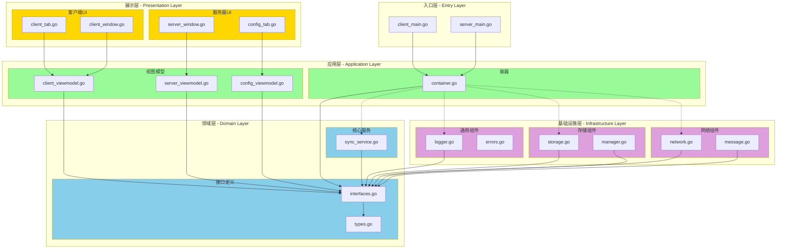
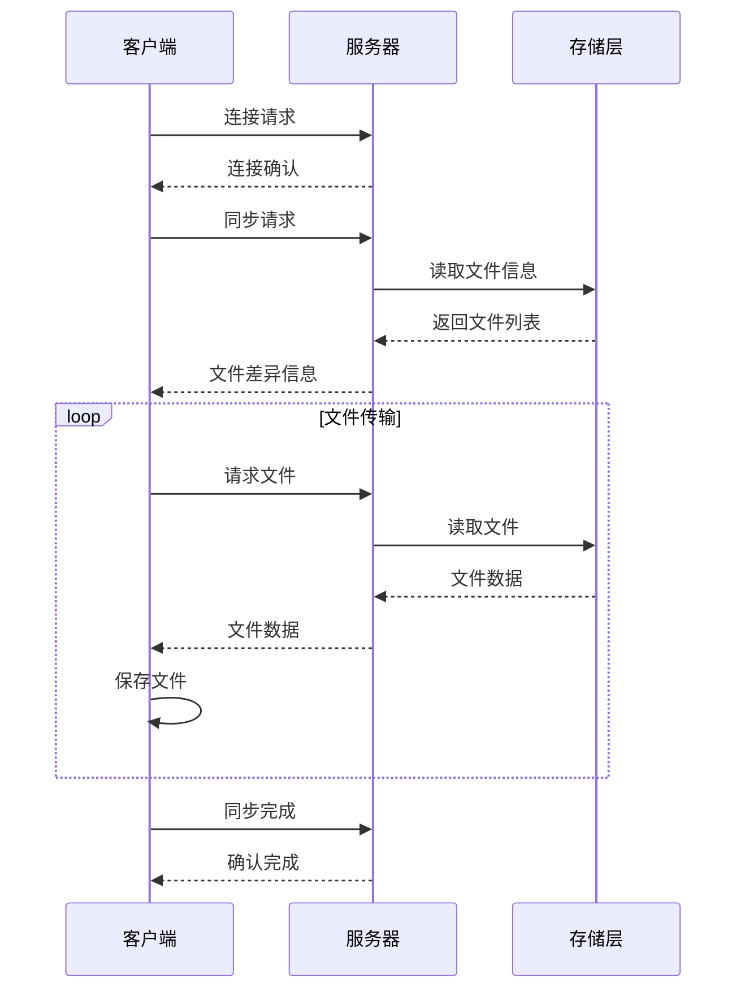

# SyncTools 项目文档

## 项目概述
SyncTools 是一个基于 Go 语言开发的文件同步工具，支持客户端-服务器架构，提供文件同步、传输和管理功能。项目采用模块化设计，使用依赖注入实现组件解耦，并提供了图形用户界面。

## 项目结构

### 命令行入口 (cmd/)
- `cmd/client/client_main.go`: 客户端程序入口
  - 初始化配置和组件
  - 启动 GUI 界面
  - 启动同步服务
  
- `cmd/server/server_main.go`: 服务器程序入口
  - 初始化配置和组件
  - 启动网络服务
  - 启动 GUI 界面

### 内部实现 (internal/)

#### 容器 (internal/container/)
- `container.go`: 依赖注入容器
  - 服务注册和获取
  - 组件生命周期管理
  - 配置管理

#### 接口定义 (internal/interfaces/)
- `interfaces.go`: 核心接口定义
  - 配置管理接口
  - 网络接口
  - 存储接口
  - 同步服务接口
  
- `types.go`: 数据类型定义
  - 配置相关类型
  - 同步相关类型
  - 消息相关类型
  - 进度相关类型

#### 用户界面 (internal/ui/)

##### 客户端 UI (internal/ui/client/)
- `viewmodels/client_viewmodel.go`: 客户端视图模型
  - 状态管理
  - 业务逻辑处理
  - UI 数据绑定
  
- `views/client_tab.go`: 客户端标签页
  - UI 布局
  - 用户交互处理
  
- `windows/client_window.go`: 客户端主窗口
  - 窗口创建和初始化
  - 事件处理

##### 服务器 UI (internal/ui/server/)
- `viewmodels/server_viewmodel.go`: 服务器视图模型
  - 服务器状态管理
  - 同步请求处理
  
- `viewmodels/config_viewmodel.go`: 配置视图模型
  - 配置数据管理
  - 配置界面交互
  
- `views/config_tab.go`: 配置标签页
  - 配置界面布局
  - 配置操作处理
  
- `windows/server_window.go`: 服务器主窗口
  - 窗口创建和初始化
  - 事件处理

### 包实现 (pkg/)

#### 配置管理 (pkg/config/)
- `manager.go`: 配置管理器
  - 配置文件加载和保存
  - 配置验证
  - 配置列表管理

#### 错误处理 (pkg/errors/)
- `errors.go`: 错误处理
  - 错误类型定义
  - 错误创建和判断

#### 日志记录 (pkg/logger/)
- `logger.go`: 日志记录器
  - 日志级别管理
  - 日志记录方法
  - 日志适配器

#### 网络通信 (pkg/network/)
- `client/client_network.go`: 客户端网络实现
  - 连接管理
  - 数据收发
  - 文件传输
  
- `server/server_network.go`: 服务器网络实现
  - 客户端连接管理
  - 服务启动和停止
  - 消息处理
  
- `message/message.go`: 消息处理
  - 消息发送和接收
  - 文件传输

#### 同步服务 (pkg/service/)
- `base/sync_service_base.go`: 同步服务基类
  - 基础功能实现
  - 状态管理
  - 配置管理
  
- `client/sync_service_client.go`: 客户端同步服务
  - 连接管理
  - 文件同步
  
- `server/sync_service_server.go`: 服务器同步服务
  - 同步请求处理
  - 服务器状态管理

#### 存储管理 (pkg/storage/)
- `storage.go`: 文件存储实现
  - 文件操作
  - 数据持久化

## 主要功能

### 文件同步
- 支持多种同步模式：镜像、推送、打包、手动
- 文件变更检测和同步
- 增量同步支持
- 同步进度跟踪

### 网络通信
- TCP 连接管理
- 消息序列化和反序列化
- 文件传输协议
- 断线重连机制

### 配置管理
- 配置文件加载和保存
- 配置验证和更新
- 多配置支持
- 配置变更通知

### 用户界面
- 客户端连接管理
- 服务器状态监控
- 配置界面
- 同步进度显示

### 文件处理
- 文件压缩和解压
- 文件完整性验证
- 文件信息管理
- 存储接口抽象

## 技术特点
1. 模块化设计：清晰的模块划分，便于维护和扩展
2. 依赖注入：使用容器管理组件依赖，降低耦合
3. 接口抽象：通过接口定义实现组件解耦
4. 错误处理：统一的错误处理机制
5. 日志系统：完善的日志记录功能
6. GUI支持：基于图形界面的操作交互
7. 配置灵活：支持多种同步配置和模式

## 开发规范
1. 代码组织：按功能模块划分目录结构
2. 接口设计：通过接口定义组件契约
3. 错误处理：统一的错误码和错误类型
4. 日志记录：分级的日志记录机制
5. 注释规范：包含中文注释的代码文档
6. 配置管理：结构化的配置定义和处理

## 架构层级

### 整体架构
```
+------------------+
|     展示层       |  GUI界面、用户交互
+------------------+
         ↓
+------------------+
|     应用层       |  业务逻辑、状态管理
+------------------+
         ↓
+------------------+
|     领域层       |  核心业务规则、接口定义
+------------------+
         ↓
+------------------+
|   基础设施层     |  技术实现、外部接口
+------------------+
```

### 层级职责

#### 展示层 (Presentation Layer)
- 位置：`internal/ui/`
- 组件：
  ```
  ui/
  ├── client/
  │   ├── views/        # 视图实现
  │   ├── viewmodels/   # 视图模型
  │   └── windows/      # 窗口管理
  └── server/
      ├── views/        # 视图实现
      ├── viewmodels/   # 视图模型
      └── windows/      # 窗口管理
  ```
- 职责：
  - 用户界面渲染
  - 用户输入处理
  - 界面状态管理
  - 视图模型绑定

#### 应用层 (Application Layer)
- 位置：`internal/container/`, `pkg/service/`
- 组件：
  ```
  ├── container/        # 依赖注入容器
  └── service/
      ├── base/        # 基础服务实现
      ├── client/      # 客户端服务
      └── server/      # 服务器服务
  ```
- 职责：
  - 业务流程编排
  - 事务管理
  - 服务组装
  - 依赖注入

#### 领域层 (Domain Layer)
- 位置：`internal/interfaces/`
- 组件：
  ```
  interfaces/
  ├── interfaces.go    # 核心接口定义
  └── types.go        # 领域类型定义
  ```
- 职责：
  - 业务规则定义
  - 接口契约
  - 领域模型
  - 业务约束

#### 基础设施层 (Infrastructure Layer)
- 位置：`pkg/`
- 组件：
  ```
  pkg/
  ├── config/         # 配置管理
  ├── errors/         # 错误处理
  ├── logger/         # 日志记录
  ├── network/        # 网络通信
  │   ├── client/
  │   ├── server/
  │   └── message/
  └── storage/        # 存储实现
  ```
- 职责：
  - 技术实现
  - 外部服务集成
  - 基础设施服务
  - 通用工具支持

### 依赖关系
```
+------------------+
|     展示层       |
+------------------+
         ↓
+------------------+
|     应用层       |
+------------------+
         ↓
+------------------+
|     领域层       |
+------------------+
         ↑
+------------------+
|   基础设施层     |
+------------------+

说明：
→ 表示依赖方向
- 上层依赖下层
- 基础设施层依赖领域层接口
- 所有层都遵循依赖倒置原则
```

### 设计原则
1. **依赖倒置原则**
   - 高层模块不应依赖低层模块，两者都应依赖抽象
   - 抽象不应依赖细节，细节应依赖抽象

2. **关注点分离**
   - 每一层都有其特定的职责
   - 层与层之间通过接口通信
   - 避免跨层调用

3. **接口隔离**
   - 接口精简，职责单一
   - 客户端不应依赖它不使用的接口
   - 接口应该是细粒度的，服务于特定客户

4. **封装变化**
   - 将容易变化的部分封装在接口后面
   - 稳定的抽象位于领域层
   - 技术实现细节位于基础设施层

## 架构流程图


## 数据流


## 组件交互
```mermaid
flowchart TB
    subgraph UI[用户界面]
        direction TB
        View[视图]
        ViewModel[视图模型]
    end
    
    subgraph Service[服务层]
        direction TB
        SyncService[同步服务]
        ConfigService[配置服务]
    end
    
    subgraph Network[网络层]
        direction TB
        Client[客户端]
        Server[服务器]
    end
    
    subgraph Storage[存储层]
        direction TB
        FileSystem[文件系统]
        Config[配置存储]
    end

    View <--> ViewModel
    ViewModel <--> SyncService
    ViewModel <--> ConfigService
    SyncService <--> Network
    ConfigService <--> Storage
    Network <--> Storage