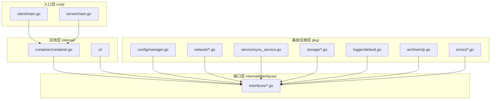

# SyncTools 代码库说明

## 项目概述
SyncTools是一个基于Go语言开发的文件同步工具，采用客户端-服务器架构，具有图形用户界面。项目致力于提供高效、可靠的文件同步解决方案。

## 项目结构

### 根目录文件
- `go.mod`: Go项目依赖管理文件
- `go.sum`: Go项目依赖版本锁定文件
- `README.md`: 项目说明文档
- `LICENSE`: 项目许可证
- `client.exe`: 客户端可执行文件
- `server.exe`: 服务端可执行文件
- `app.manifest`: 应用程序清单文件
- `CODEBASE.md`: 代码库说明文档

### cmd/ - 入口程序
#### client/main.go
- **文件作用**：
  - 实现客户端的主程序入口
  - 初始化客户端配置和组件
  - 启动GUI界面和同步服务
  - 管理客户端状态和配置
- **主要方法**：
  - main: 程序入口,初始化各个组件并启动GUI界面
  - init: 初始化基础配置和命令行参数
  - loadOrCreateConfig: 加载或创建默认配置文件

#### server/main.go
- **文件作用**：
  - 实现服务器的主程序入口
  - 初始化服务器配置和组件
  - 启动网络服务和GUI界面
  - 管理服务器状态和配置
- **主要方法**：
  - main: 程序入口,初始化各个组件并启动服务器
  - init: 初始化基础配置和命令行参数
  - loadOrCreateConfig: 加载或创建默认配置文件

### internal/ - 内部包

#### container/container.go
- **文件作用**：
  - 实现依赖注入容器
  - 管理所有服务实例的生命周期
  - 提供服务注册和获取功能
  - 负责服务的初始化和关闭
- **主要方法**：
  - New: 创建新的依赖注入容器
  - Register: 注册服务到容器
  - Get: 从容器获取服务
  - InitializeServices: 初始化所有服务
  - GetLogger/GetConfigManager/GetNetworkServer/GetSyncService/GetStorage: 获取特定服务
  - Shutdown: 关闭所有服务

#### interfaces/ - 接口定义
- **config.go**: 定义配置管理接口
- **logger.go**: 定义日志记录接口
- **network.go**: 定义网络操作接口
- **service.go**: 定义同步服务接口
- **storage.go**: 定义存储操作接口
- **types.go**: 定义共享数据类型

#### ui/ - 用户界面
##### client/ - 客户端UI
- **views/client_tab.go**: 客户端主界面实现
- **viewmodels/client_viewmodel.go**: 客户端视图模型
- **windows/client_window.go**: 客户端窗口管理

##### server/ - 服务端UI
- **views/config_tab.go**: 服务端配置界面
- **viewmodels/server_viewmodel.go**: 服务端视图模型
- **viewmodels/config_viewmodel.go**: 配置视图模型
- **windows/server_window.go**: 服务端窗口管理

##### common/ - 公共UI组件
- **logger/adapter.go**: 日志适配器

### pkg/ - 可重用包

#### archive/zip.go
- **文件作用**：
  - 实现文件压缩和解压功能
  - 提供进度报告
  - 处理文件完整性验证

#### config/manager.go
- **文件作用**：
  - 实现配置管理器
  - 负责配置文件的加载、保存和验证
  - 管理配置的生命周期和变更通知
- **主要方法**：
  - NewManager: 创建配置管理器
  - LoadConfig: 加载配置
  - SaveConfig: 保存配置
  - ValidateConfig: 验证配置
  - GetCurrentConfig: 获取当前配置

#### errors/ - 错误定义
- **common.go**: 通用错误类型
- **config.go**: 配置相关错误
- **network.go**: 网络相关错误
- **service.go**: 服务相关错误
- **storage.go**: 存储相关错误

#### logger/default.go
- **文件作用**：
  - 实现默认日志记录器
  - 支持不同日志级别
  - 提供结构化日志记录

#### network/ - 网络实现
- **server.go**: 网络服务器实现
- **operations.go**: 网络操作实现

#### service/sync_service.go
- **文件作用**：
  - 实现文件同步服务
  - 管理同步状态和进度
  - 处理同步请求和响应

#### storage/ - 存储实现
- **file_storage.go**: 文件存储实现
- **file_utils.go**: 文件操作工具

### configs/ - 配置文件
- `default.json`: 默认配置文件
- `*.json`: 用户配置文件

### logs/ - 日志文件
- `sync_*.log`: 同步操作日志文件

## 架构设计

### 分层架构

### 设计原则

1. **依赖倒置**
   - 所有组件依赖于接口而非实现
   - 通过接口层实现解耦
   - 便于测试和替换实现

2. **关注点分离**
   - UI层：负责用户界面和交互
   - 服务层：处理业务逻辑
   - 存储层：处理数据持久化
   - 网络层：处理通信

3. **MVVM模式**
   - Model: 数据模型和业务逻辑
   - ViewModel: 视图模型，处理UI逻辑
   - View: 用户界面实现

4. **错误处理**
   - 统一的错误类型体系
   - 结构化的错误信息
   - 错误追踪和日志记录

5. **配置管理**
   - 集中的配置管理
   - 配置验证和迁移
   - 实时配置更新

6. **日志系统**
   - 分级日志记录
   - 结构化日志
   - 可配置的日志输出

### 主要功能

1. **文件同步**
   - 多种同步模式：镜像、推送、打包
   - 增量同步
   - 文件完整性验证

2. **网络通信**
   - TCP长连接
   - JSON消息协议
   - 断线重连

3. **用户界面**
   - 配置管理
   - 同步状态监控
   - 进度显示

4. **存储管理**
   - 文件存储
   - 配置持久化
   - 缓存管理

## 开发指南

### 添加新功能
1. 在接口层定义接口
2. 在基础设施层实现接口
3. 在容器中注册服务
4. 更新UI（如需要）

### 错误处理
1. 使用特定的错误类型
2. 记录详细的错误信息
3. 提供用户友好的错误提示

### 测试策略
1. 单元测试：测试独立组件
2. 集成测试：测试组件交互
3. UI测试：测试用户界面
4. 性能测试：测试同步性能

### 日志规范
1. 使用适当的日志级别
2. 包含上下文信息
3. 避免敏感信息

## 技术栈

### 核心技术
- 语言：Go
- GUI框架：walk
- 网络：标准库net包
- 存储：文件系统操作
- 日志：结构化日志
- 配置：JSON配置文件

### 开发工具
- IDE：支持Go的任意IDE
- 构建工具：Go build
- 依赖管理：Go modules
- 版本控制：Git

## 部署说明

### 环境要求
- Go 1.16+
- Windows 7/10/11
- 足够的磁盘空间用于文件同步

### 构建步骤
1. 克隆代码库
2. 安装依赖：`go mod download`
3. 构建客户端：`go build cmd/client/main.go`
4. 构建服务端：`go build cmd/server/main.go`

### 配置说明
1. 默认配置文件位于 `configs/default.json`
2. 可通过命令行参数指定配置文件
3. 支持运行时修改配置

### 运行说明
1. 启动服务端：`server.exe`
2. 启动客户端：`client.exe`
3. 配置同步参数
4. 开始同步操作