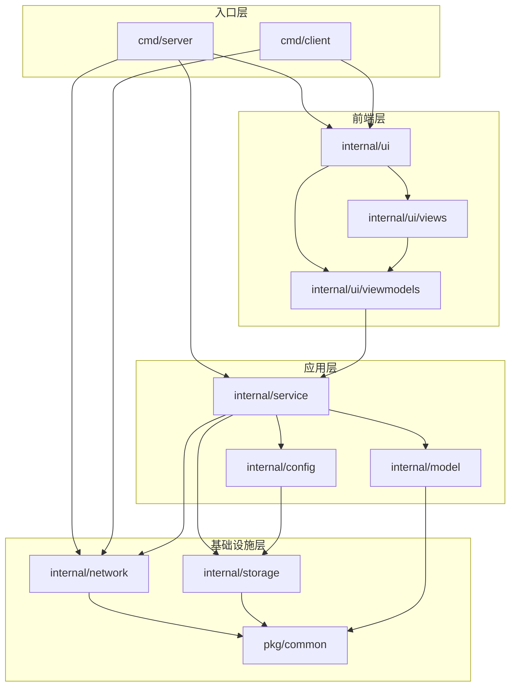

# SyncTools 代码库文档

## cmd/
### client/main.go
客户端入口文件，负责启动客户端应用程序。

### server/main.go
服务器入口文件，负责启动服务器应用程序。

## internal/

### config/
#### manager.go
- **文件作用**：
  - 管理配置文件的读取和保存
  - 维护当前活动配置
  - 处理配置变更通知
  - 提供配置验证功能
- **主要方法**：
  - NewManager: 创建新的配置管理器
  - LoadConfig: 加载指定的配置文件
  - SaveConfig: 保存配置到文件
  - GetCurrentConfig: 获取当前活动配置
  - ValidateConfig: 验证配置有效性

### model/
#### types.go
- **文件作用**：
  - 定义核心数据结构和接口
  - 实现配置模型
  - 提供状态管理功能
  - 定义同步模式和操作类型
- **主要类型**：
  - Config: 配置信息结构
  - SyncFolder: 同步文件夹配置
  - ClientState: 客户端状态信息
  - PackState: 压缩包状态信息
  - Logger: 日志记录接口

#### logger.go
- **文件作用**：
  - 定义日志接口
  - 提供日志记录功能
  - 支持不同级别的日志

### network/
#### server.go
- **文件作用**：
  - 实现服务器端网络通信
  - 管理客户端连接
  - 处理同步请求
  - 实现文件传输
- **主要类型**：
  - Server: 网络服务器
  - Client: 客户端连接
  - ClientMessage: 客户端消息
  - FileOperation: 文件操作接口
  - TransferResult: 传输结果
- **主要方法**：
  - NewServer: 创建新的服务器实例
  - Start: 启动服务器
  - Stop: 停止服务器
  - handleMessage: 处理客户端消息
  - handleSyncRequest: 处理同步请求
  - handleFileTransfer: 处理文件传输
  - handlePackTransfer: 处理压缩包传输
  - sendResponse: 发送响应消息

### service/
#### service.go
- **文件作用**：
  - 实现业务逻辑服务
  - 协调各个组件的工作
  - 处理同步操作
  - 管理配置服务

### storage/
#### storage.go
- **文件作用**：
  - 提供统一的存储接口
  - 实现基于文件系统的存储
  - 支持多种数据类型的存储和加载
  - 管理配置文件的持久化
- **主要类型**：
  - Storage: 存储接口定义
  - FileStorage: 基于文件系统的存储实现
- **主要方法**：
  - NewFileStorage: 创建新的文件存储实例
  - Save: 保存数据到存储
  - Load: 从存储加载数据
  - Delete: 删除存储的数据
  - List: 列出所有存储的数据项

### ui/
#### main_window.go
- **文件作用**：
  - 实现主窗口界面
  - 管理界面布局
  - 处理窗口事件

#### viewmodels/config_viewmodel.go
- **文件作用**：
  - 实现配置界面的视图模型
  - 管理配置数据绑定
  - 处理配置界面交互
  - 提供配置操作接口
- **主要类型**：
  - ConfigViewModel: 配置视图模型
  - ConfigListModel: 配置列表模型
  - SyncFolderModel: 同步文件夹模型
- **主要方法**：
  - NewConfigViewModel: 创建配置视图模型
  - LoadConfig: 加载配置
  - SaveConfig: 保存配置
  - UpdateUI: 更新界面
  - AddSyncFolder: 添加同步文件夹
  - RemoveSyncFolder: 移除同步文件夹

#### viewmodels/interfaces.go
- **文件作用**：
  - 定义视图模型接口
  - 定义UI组件接口
  - 提供接口约束

#### viewmodels/main_viewmodel.go
- **文件作用**：
  - 实现主窗口的视图模型
  - 管理主界面状态
  - 协调子视图模型

#### views/config_tab.go
- **文件作用**：
  - 实现配置界面的UI布局和交互
  - 管理配置界面的各个控件
  - 处理用户界面事件
  - 与视图模型层交互
- **主要类型**：
  - ConfigTab: 配置界面标签页
  - ConfigTabInterface: 配置界面接口
- **主要方法**：
  - NewConfigTab: 创建新的配置界面
  - Setup: 设置UI组件和布局
  - onConfigActivated: 处理配置选择事件
  - onNewConfig: 处理新建配置事件
  - onDeleteConfig: 处理删除配置事件
  - onSave: 处理保存配置事件
  - onStartServer: 处理启动服务器事件
  - onStopServer: 处理停止服务器事件

## pkg/common/
#### logger.go
- **文件作用**：
  - 提供通用日志功能
  - 实现日志记录接口
  - 支持多种日志级别
  - 提供文件和回调两种日志输出方式
- **主要类型**：
  - Logger: 日志记录器接口
  - DefaultLogger: 基于文件的日志记录器
  - CallbackLogger: 基于回调的日志记录器
- **主要方法**：
  - NewDefaultLogger: 创建基于文件的日志记录器
  - NewCallbackLogger: 创建基于回调的日志记录器
  - Log: 记录普通日志
  - Error: 记录错误日志
  - Info: 记录信息日志
  - DebugLog: 记录调试日志
  - SetDebugMode: 设置调试模式
  - Close: 关闭日志记录器

#### network.go
- **文件作用**：
  - 提供网络通信基础功能
  - 实现JSON数据的收发
  - 实现文件传输功能
  - 提供文件信息获取功能
- **主要方法**：
  - WriteJSON: 写入JSON数据到网络连接
  - ReadJSON: 从网络连接读取JSON数据
  - ReceiveFile: 接收文件数据并保存
  - ReceiveFileToWriter: 接收文件数据并写入指定writer
  - GetFilesInfo: 获取目录下所有文件的信息

#### types.go
- **文件作用**：
  - 定义同步配置相关结构
  - 定义同步状态相关结构
  - 定义文件信息相关结构
  - 实现GUI日志记录器
  - 提供配置缓存刷新功能
- **主要类型**：
  - Config: 核心配置结构
  - SyncFolder: 同步文件夹配置
  - FileInfo: 文件信息结构
  - SyncInfo: 同步信息结构
  - GUILogger: GUI日志记录器
  - ConfigManager: 配置管理器接口
  - SyncService: 同步服务接口
  - Server: 服务器接口
- **主要方法**：
  - NewGUILogger: 创建新的GUI日志记录器
  - NewUUID: 生成唯一标识符
  - LoadConfig: 加载配置
  - SaveConfig: 保存配置
  - refreshCache: 刷新配置缓存
  - CalculateFolderMD5: 计算文件夹MD5值
  - CalculateFileHash: 计算文件哈希值

#### utils.go
- **文件作用**：
  - 提供通用工具函数
  - 提供文件操作工具
  - 提供哈希计算功能
  - 提供路径处理工具
  - 提供时间处理函数
- **主要方法**：
  - CalculateFileHash: 计算文件哈希值
  - EnsureDir: 确保目录存在
  - CleanupTempFiles: 清理临时文件
  - IsPathExists: 检查路径是否存在
  - CopyFile: 复制文件
  - GetRelativePath: 获取相对路径

#### zip.go
- **文件作用**：
  - 提供压缩和解压功能
  - 处理文件打包
  - 管理压缩文件操作 

## 文件依赖关系

### 层级说明

1. **前端层**
   - 负责用户界面展示和交互
   - 包含视图(Views)和视图模型(ViewModels)
   - 使用 walk 库实现 GUI 功能

2. **应用层**
   - 实现核心业务逻辑
   - 协调各个组件工作
   - 管理配置和同步服务

3. **基础设施层**
   - 提供底层功能支持
   - 实现网络通信
   - 处理数据存储
   - 提供通用工具

4. **入口层**
   - 提供程序入口点
   - 初始化各个组件
   - 启动服务和界面